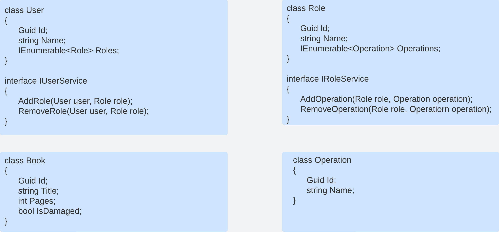
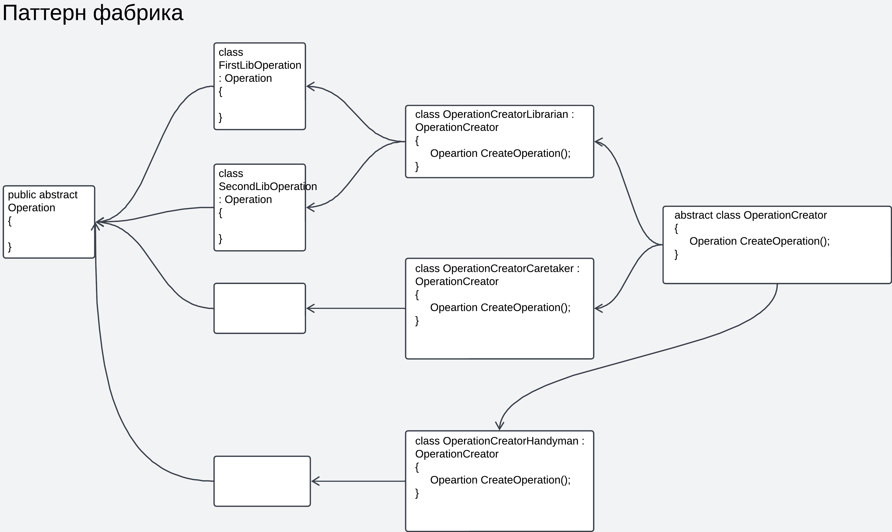
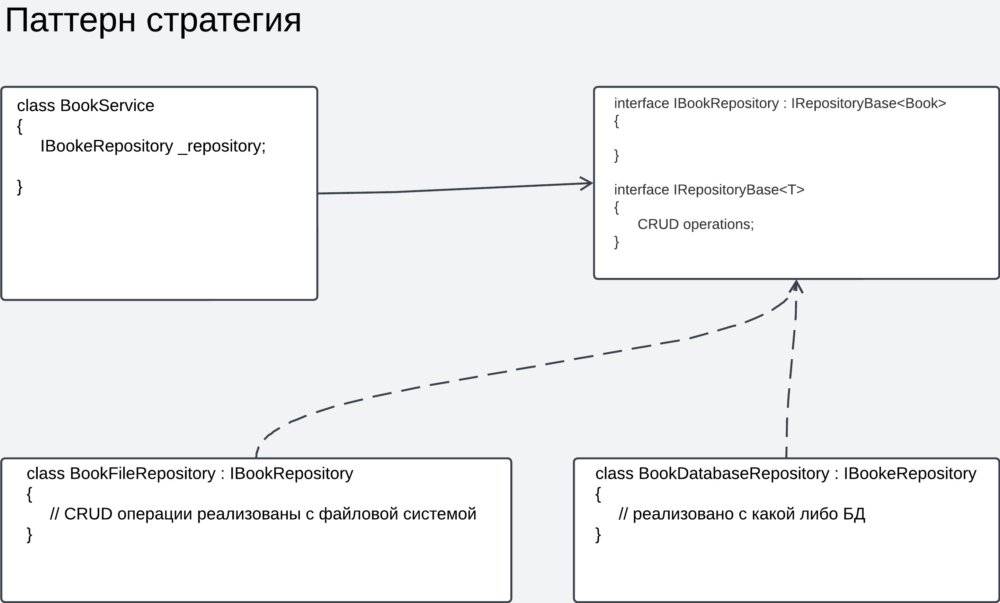

# Task1
## Реализация первого задания
Для запуска приложения необходимо:
* склонировать репозиторий
* далее в папке Task1.Api/ создать appsettings.personal.json, заполнить строки подключений
```json
{
  "ConnectionStrings": {
    "PostgreDeploy": "*",
    "PostgreDebug": "*"
  }
}
```
* перед тем как собрать docker image проверьте в Task1.Api/Program.cs, тогда строка подключения возьмёться из PostgreDeploy
```csharp
#region DataAccess

builder.ConfigureDataAcess(isProduction: true);

#endregion
```
* соберите docker image, в корневой папке запустить команду "docker build -t api-image ." (если нужно поменять имя image, его также нужно поменять в docker-compose.yaml)
* в корневой папке запустите команду "docker compose up"

Для взаимодействия с приложением можно использовать postman
1. Endpoint с входящим параметром - дата.
Результат запроса - ответ, указывающий на корректность выполнения загрузки данных в разработанную систему о курсах за выбранную дату.
url: http://localhost:5436/Currency/load
body: 
```json
{
    "Date": "дата в формате yyyy-MM-dd"
}
```
если передать null, то загрузятся данные за текущую дату

2. Endpoint с входящими параметрами - дата и код валюты. Результат запроса - информация о курсе валюты за указанный день.
url: http://localhost:5436/Currency/get
body: 
```json
{
    "Date": "дата в формате yyyy-MM-dd",
    "Cur_ID": "код валюты"
}
```
если передать вместо даты null, выставиться сегодняшняя дата в запросе к бд
если передать вместо кода валюты null, будет возвращён список данных за переданную дату

В проекте использованы все ожидаемые технологии из ТЗ (Entity Framework, EF Migrations, XUnit, Swagger, Serilog, PostrgeSQL, Docker/Docker Compose)

## Реализация второго задания
<figure>
    
    <figcaption>Классы для проекта</figcaption>
</figure>

Требование (- зарегистрированные в системе пользователи могут обладать сразу
несколькими ролями;) будет реализовано содержанием связи между моделями User и Role многие ко многим.

Требование (- необходимо предусмотреть возможность добавления в систему новых
пользовательских ролей и операций, а также редактирование списка операций,
свойственных каждой роли, без необходимости перекомпиляции основного
модуля;
) разрешу используя паттерн Фабрика
<figure>
    
</figure>
здесь класс Operation будет взаимодействовать с репозиторием и непосредственно работать с книгами. Как было предложено в задании системные роли пораждают 3 создателя операций (библиотекарь, завхоз, подсобный рабочий). Данные создатели будут создавать определённых наследников класса Operation, в зависимости от выполняемой операции.

Требование (- решение должно быть абстрагировано от реализации пользовательского
интерфейса и репозитория.) разрешу используя паттерн Стратегия
<figure>
    
</figure>


